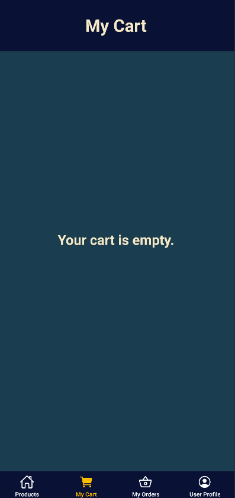

# Ecommerce React Native App

## Overview
An e-commerce platform that allows users to browse products, manage a shopping cart, and process orders, leveraging the Fake Store API for product data and a dedicated backend service for user and order management.

## Tech Stack

*   **Frontend:** React Native
*   **State Management:** Redux Toolkit
*   **Backend:** The backend for this project is provided by Griffith University and is located in the `fake-store-server` directory. This Express.js server uses SQLite for data storage and provides RESTful APIs for users, cart, and orders.

## App Screenshots

<table>
  <tr align="center">
    <td>
Splash Screen
</td>
    <td>
Sign In Form
</td>
    <td>
Sign Up Form
</td>
    <td>
Protected Tabs Warning
</td>
  </tr>
</table>

<table>
  <tr align="center">
    <td>
User Profile Screen
</td>
    <td>
Update Profile Form
</td>
    <td>
Empty Cart Screen
</td>
    <td>
Empty Order Screen
</td>
  </tr>
</table>

<table>
  <tr align="center">
    <td>
Categories Screen
</td>
    <td>
Products Screen
</td>
    <td>
Product Details Screen
</td>
    <td>
Success Added to Cart Notification
</td>
  </tr>
</table>

<table>
  <tr align="center">
    <td>
My Cart Screen
</td>
    <td>
Checkout Success Notification
</td>
    <td>
New Order in My Orders (Pay Button)
</td>
  </tr>
</table>

<table>
  <tr align="center">
    <td>
Paid Order in My Orders (Receive Button)
</td>
    <td>
Delivered Order in My Orders
</td>
    <td>
My Orders Screen Overview
</td>
  </tr>
</table>
<table>
  <tr align="center">
    <td>
Invalid Email Error from Server
</td>
    <td>
Password Rules Error from Server
</td>
    <td>
Password Checking Error from Server
</td>
    <td>
Required Fields Error from Server
</td>
  </tr>
</table>

## APIs Used

*   **Fake Store API (`https://fakestoreapi.com/`):** Provides product information, categories, and product details.
*   **Griffith University API (`fake-store-server`):**
    *   Handles user registration, authentication (sign-in/sign-up with JWT), and session management.
    *   Manages user profile updates (name, password).
    *   Provides persistent shopping cart functionality.
    *   Manages order creation, retrieval, and status updates (e.g., new, paid, delivered) using an SQLite database.
    *   API documentation for this server is available via Swagger at `http://localhost:3000/api-docs` when the server is running.

## Features

*   **Splash Screen:** Displays a "Fake Store" splash screen on app launch.
*   **Authentication & Authorization:**
    *   Initial launch presents a Sign In/Sign Up screen.
    *   Protected tabs (Products, My Cart, My Orders) require login, prompting with an alert if accessed without authentication.
    *   Toggle between Sign In and Sign Up forms.
    *   **Sign Up:**
        *   Form with fields for Name, Email, and masked Password.
        *   "Clear" and "Sign Up" buttons.
        *   Server-side validation with alert notifications for errors (via Griffith University API).
        *   Successful registration logs the user in and navigates to the User Profile Screen.
    *   **Sign In:**
        *   Form titled “Sign in with your email and password” with masked password input.
        *   "Clear" and "Sign In" buttons.
        *   Upon successful sign-in (via Griffith University API), all tabs become accessible, and the User Profile displays correctly.
    *   **User Profile:**
        *   Displays the user’s name and email.
        *   "Update" and "Sign Out" buttons.
        *   "Update" button opens a modal (using `react-native-modal`) to modify name and password (with “Confirm” and “Cancel” buttons).
        *   Alerts indicate the outcome of profile updates.
    *   **Sign Out:** Restricts access to only the Sign In/Sign Up form. Badges are cleared.
*   **Shopping Cart:**
    *   Add products to the cart via navigation: Category -> Product List -> Product Detail.
    *   Displays different states: empty, single-product, and multiple-product.
    *   Cart badge (on the tab) and total cost/item count update accurately (managed by Redux).
*   **Order Management:**
    *   **Check Out:**
        *   Allows users to create an order from a non-empty cart (handled by Griffith University API).
        *   Clears the shopping cart upon successful order creation.
        *   Displays a badge on the "My Orders" tab indicating the number of new orders.
    *   **My Orders Screen:**
        *   Orders categorized into "new," "paid," and "delivered" statuses.
        *   Compact order display (order ID, item count, total price) with a toggle (caret icon using `react-native-vector-icons`) to expand for more details (product image, title, quantity).
    *   **Pay and Receive Orders:**
        *   Expanded order view includes a "Pay" button for "new" orders.
        *   Expanded order view includes a "Receive" button for "paid" orders.
        *   API calls (to Griffith University API) update order statuses, and the order list refreshes.
        *   Confirmation alerts are displayed upon status updates.
*   **Data Persistence & App State:**
    *   User session and potentially other preferences are persisted using `@react-native-async-storage/async-storage`.
    *   All badges are removed upon signing out.
    *   After re-signing in (even with a different user), shopping cart contents, orders, and related badges are accurately restored (data fetched from Griffith University API and managed by Redux).
    *   Reloading the app (completely closing and reopening) reverts it to the unlogged state (Sign In/Sign Up screen).
    *   After signing in again post-reload, the application restores all previously saved user-specific information.
